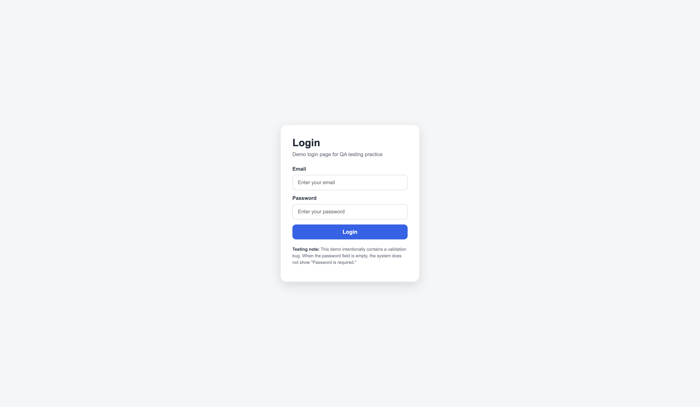
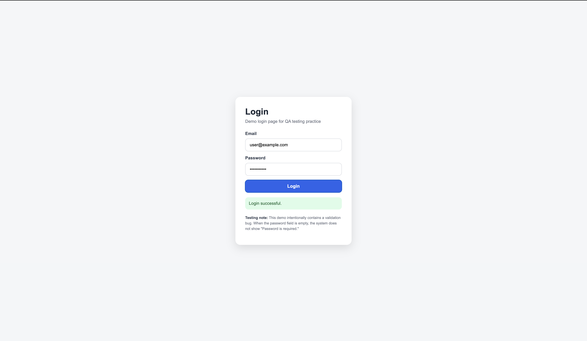
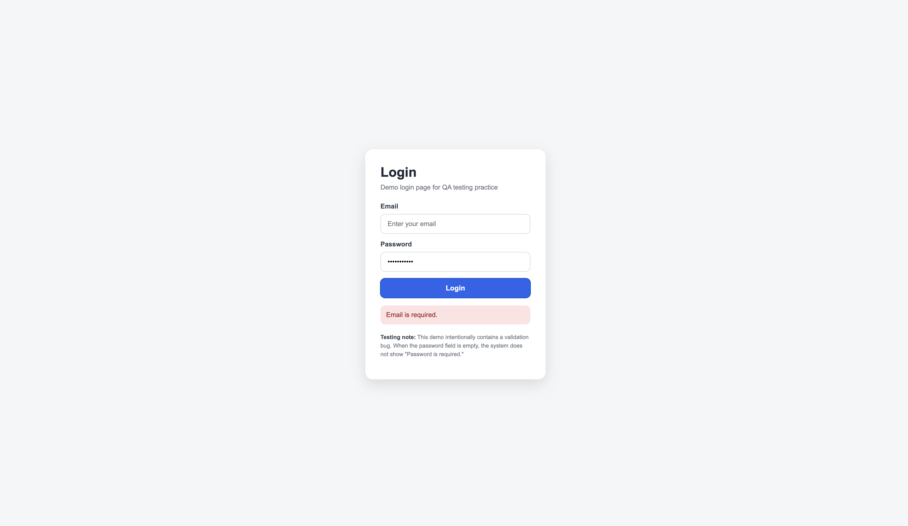
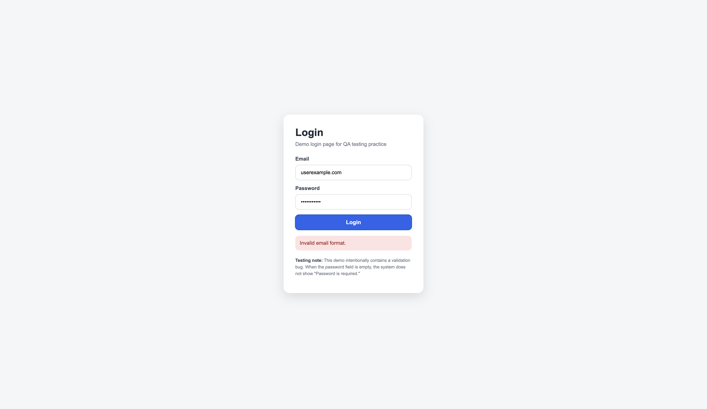
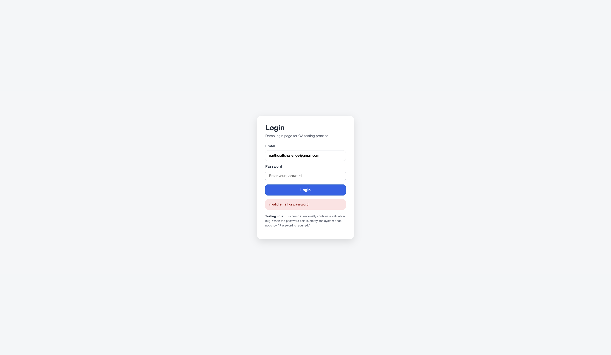

<div align="center">


<br />


<br />
<br />

<a href="https://rittiporn12.github.io/qa-portfolio-lab/demo-login/">
  
</a>

<br />
<br />

<p>
  <b>QA Portfolio Lab</b>
</p>

<p>
  A software testing portfolio project that demonstrates manual testing, API testing, test case design, bug reporting, and testing documentation.
</p>

<p>
  This project focuses on software quality, test planning, bug reporting, retesting, regression testing, and API testing practice.
</p>

</div>

<hr />

<h2 align="center">About This Project</h2>

<p align="center">
  <b>QA Portfolio Lab</b> is a software testing practice project created to demonstrate essential QA and Software Tester skills.
</p>

<p align="center">
  The repository includes a simple demo login page, manual test cases, Jira-style bug reports, a test plan, Postman API testing examples, screenshot evidence, and a final testing summary.
</p>

<p align="center">
  The main goal of this project is to show how testing documents are prepared, how bugs are reported, and how test results are summarized clearly.
</p>

<hr />

<h2 align="center">Live Demo</h2>

<div align="center">

<p>
  You can test the demo login page using the link below.
</p>

<p>
  <a href="https://rittiporn12.github.io/qa-portfolio-lab/demo-login/">
    <b>https://rittiporn12.github.io/qa-portfolio-lab/demo-login/</b>
  </a>
</p>

</div>

<hr />

<h2 align="center">Project Overview</h2>

<table align="center">
  <tr>
    <th>Section</th>
    <th>Description</th>
  </tr>
  <tr>
    <td><b>Demo Application</b></td>
    <td>A simple login page used for manual testing practice.</td>
  </tr>
  <tr>
    <td><b>Test Cases</b></td>
    <td>Manual test cases for validating login scenarios.</td>
  </tr>
  <tr>
    <td><b>Bug Reports</b></td>
    <td>Jira-style bug report documentation with severity and priority.</td>
  </tr>
  <tr>
    <td><b>Test Plan</b></td>
    <td>Testing scope, objectives, approach, and test environment.</td>
  </tr>
  <tr>
    <td><b>Postman Collection</b></td>
    <td>Sample API testing collection for login request structure.</td>
  </tr>
  <tr>
    <td><b>Testing Summary</b></td>
    <td>Final test execution summary and result overview.</td>
  </tr>
</table>

<hr />

<h2 align="center">What This Project Includes</h2>

<table align="center">
  <tr>
    <th>Item</th>
    <th>Description</th>
  </tr>
  <tr>
    <td>Manual Test Cases</td>
    <td>Test cases for valid login, invalid login, empty fields, and validation messages.</td>
  </tr>
  <tr>
    <td>Bug Reports</td>
    <td>Bug report written in Jira-style format with expected and actual results.</td>
  </tr>
  <tr>
    <td>Test Plan</td>
    <td>Testing plan for the login feature including scope and approach.</td>
  </tr>
  <tr>
    <td>API Testing</td>
    <td>Postman collection for sample API testing practice.</td>
  </tr>
  <tr>
    <td>Retest Notes</td>
    <td>Documentation for checking whether a fixed bug works correctly.</td>
  </tr>
  <tr>
    <td>Regression Testing Notes</td>
    <td>Notes for confirming that existing features still work after changes.</td>
  </tr>
  <tr>
    <td>Testing Summary</td>
    <td>Final result summary showing passed, failed, and blocked test cases.</td>
  </tr>
</table>

<hr />

<h2 align="center">Built With</h2>

<div align="center">

<table>
  <tr>
    <td align="center">HTML</td>
    <td align="center">CSS</td>
    <td align="center">JavaScript</td>
    <td align="center">Postman</td>
    <td align="center">Browser DevTools</td>
    <td align="center">Markdown</td>
    <td align="center">GitHub Pages</td>
  </tr>
</table>

</div>

<hr />

<h2 align="center">Testing Skills Demonstrated</h2>

<table align="center">
  <tr>
    <th>Skill</th>
    <th>Practice</th>
  </tr>
  <tr>
    <td>Test Case Design</td>
    <td>Created structured test cases with steps, expected results, and actual results.</td>
  </tr>
  <tr>
    <td>Bug Reporting</td>
    <td>Documented defects using a Jira-style format with severity and priority.</td>
  </tr>
  <tr>
    <td>Manual Testing</td>
    <td>Tested login scenarios through user input and UI validation.</td>
  </tr>
  <tr>
    <td>API Testing</td>
    <td>Designed sample API requests using Postman.</td>
  </tr>
  <tr>
    <td>Retest</td>
    <td>Reviewed failed test cases after bug fixes.</td>
  </tr>
  <tr>
    <td>Regression Testing</td>
    <td>Checked that existing login scenarios still work after changes.</td>
  </tr>
  <tr>
    <td>Testing Documentation</td>
    <td>Created test plan, test cases, bug report, screenshot evidence, and summary report.</td>
  </tr>
</table>

<hr />

<h2 align="center">Project Structure</h2>

```txt
qa-portfolio-lab/
├── README.md
├── .gitignore
├── demo-login/
│   └── index.html
├── test-cases/
│   └── login-test-case.md
├── bug-reports/
│   └── login-validation-bug.md
├── test-plan/
│   └── test-plan.md
├── postman/
│   └── user-api-testing.postman_collection.json
├── screenshots/
│   ├── README.md
│   ├── login-page.png
│   ├── valid-login.png
│   ├── empty-email-validation.png
│   ├── invalid-email-format.png
│   └── bug-example.png
└── docs/
    └── testing-summary.md
```

<hr />

<h2 align="center">Demo Application</h2>

<p align="center">
  This repository includes a simple demo login page located in <code>demo-login/index.html</code>.
</p>

<p align="center">
  The demo page is used as a sample application for manual testing practice. It intentionally contains a password validation issue so the testing documents can demonstrate how to write test cases, bug reports, and testing summaries.
</p>

<div align="center">

<a href="https://rittiporn12.github.io/qa-portfolio-lab/demo-login/">
  
</a>

</div>

<hr />

<h2 align="center">Demo Test Data</h2>

<table align="center">
  <tr>
    <th>Scenario</th>
    <th>Email</th>
    <th>Password</th>
    <th>Expected Result</th>
  </tr>
  <tr>
    <td>Valid login</td>
    <td><code>user@example.com</code></td>
    <td><code>Password123</code></td>
    <td>Login successful</td>
  </tr>
  <tr>
    <td>Empty email</td>
    <td><code>empty</code></td>
    <td><code>Password123</code></td>
    <td>Email is required</td>
  </tr>
  <tr>
    <td>Invalid email format</td>
    <td><code>userexample.com</code></td>
    <td><code>Password123</code></td>
    <td>Invalid email format</td>
  </tr>
  <tr>
    <td>Empty password</td>
    <td><code>user@example.com</code></td>
    <td><code>empty</code></td>
    <td>Password is required</td>
  </tr>
  <tr>
    <td>Invalid password</td>
    <td><code>user@example.com</code></td>
    <td><code>wrongpassword</code></td>
    <td>Invalid email or password</td>
  </tr>
</table>

<hr />

<h2 align="center">Sample Testing Scenario</h2>

<p align="center">
  This project uses a sample login feature as the main testing scenario.
</p>

<table align="center">
  <tr>
    <th>Test Condition</th>
    <th>Description</th>
  </tr>
  <tr>
    <td>Valid email and valid password</td>
    <td>Verify that the user can log in successfully.</td>
  </tr>
  <tr>
    <td>Invalid password</td>
    <td>Verify that the system shows an error for incorrect password.</td>
  </tr>
  <tr>
    <td>Empty email field</td>
    <td>Verify that the system validates an empty email field.</td>
  </tr>
  <tr>
    <td>Empty password field</td>
    <td>Verify that the system validates an empty password field.</td>
  </tr>
  <tr>
    <td>Invalid email format</td>
    <td>Verify that the system validates incorrect email format.</td>
  </tr>
  <tr>
    <td>API response validation</td>
    <td>Verify API request and response structure using Postman.</td>
  </tr>
  <tr>
    <td>Error message validation</td>
    <td>Verify that validation messages are clear and correct.</td>
  </tr>
</table>

<hr />

<h2 align="center">Test Result Overview</h2>

<table align="center">
  <tr>
    <th>Total Test Cases</th>
    <th>Passed</th>
    <th>Failed</th>
    <th>Blocked</th>
  </tr>
  <tr>
    <td>5</td>
    <td>4</td>
    <td>1</td>
    <td>0</td>
  </tr>
</table>

<p align="center">
  One failed test case was found in password field validation and documented in the bug report.
</p>

<hr />

<h2 align="center">Testing Evidence</h2>

<p align="center">
  Screenshots are stored in the <code>screenshots</code> folder and used as evidence for test execution and bug reporting.
</p>

<table align="center">
  <tr>
    <th>Screenshot</th>
    <th>Description</th>
  </tr>
  <tr>
    <td><code>login-page.png</code></td>
    <td>Default login page before testing.</td>
  </tr>
  <tr>
    <td><code>valid-login.png</code></td>
    <td>Successful login with valid credentials.</td>
  </tr>
  <tr>
    <td><code>empty-email-validation.png</code></td>
    <td>Validation message when email is empty.</td>
  </tr>
  <tr>
    <td><code>invalid-email-format.png</code></td>
    <td>Validation message when email format is invalid.</td>
  </tr>
  <tr>
    <td><code>bug-example.png</code></td>
    <td>Evidence for incorrect password validation behavior.</td>
  </tr>
</table>

<hr />

<h2 align="center">Screenshots</h2>

<h3 align="center">Login Page</h3>

<div align="center">



</div>

<h3 align="center">Valid Login</h3>

<div align="center">



</div>

<h3 align="center">Empty Email Validation</h3>

<div align="center">



</div>

<h3 align="center">Invalid Email Format</h3>

<div align="center">



</div>

<h3 align="center">Bug Example</h3>

<div align="center">



</div>

<hr />

<h2 align="center">Quick Links</h2>

<table align="center">
  <tr>
    <th>Section</th>
    <th>Link</th>
  </tr>
  <tr>
    <td>Live Demo Login Page</td>
    <td><a href="https://rittiporn12.github.io/qa-portfolio-lab/demo-login/">Open Demo</a></td>
  </tr>
  <tr>
    <td>Test Cases</td>
    <td><a href="./test-cases/login-test-case.md">View Test Cases</a></td>
  </tr>
  <tr>
    <td>Bug Report</td>
    <td><a href="./bug-reports/login-validation-bug.md">View Bug Report</a></td>
  </tr>
  <tr>
    <td>Test Plan</td>
    <td><a href="./test-plan/test-plan.md">View Test Plan</a></td>
  </tr>
  <tr>
    <td>Postman Collection</td>
    <td><a href="./postman/user-api-testing.postman_collection.json">View Postman Collection</a></td>
  </tr>
  <tr>
    <td>Testing Summary</td>
    <td><a href="./docs/testing-summary.md">View Testing Summary</a></td>
  </tr>
  <tr>
    <td>Screenshots</td>
    <td><a href="./screenshots">View Screenshots</a></td>
  </tr>
</table>

<hr />

<h2 align="center">Repository Sections</h2>

<h3>Demo Application</h3>

<p>
  The <code>demo-login</code> folder contains a simple login demo page used for manual testing practice. The page intentionally contains a password validation issue for QA documentation purposes.
</p>

<h3>Test Cases</h3>

<p>
  The <code>test-cases</code> folder contains manual test cases for the login feature.
</p>

<h3>Bug Reports</h3>

<p>
  The <code>bug-reports</code> folder contains Jira-style bug report examples.
</p>

<h3>Test Plan</h3>

<p>
  The <code>test-plan</code> folder contains the testing plan for the login feature.
</p>

<h3>Postman Collection</h3>

<p>
  The <code>postman</code> folder contains a sample Postman collection for API testing.
</p>

<p>
  <b>Note:</b> The Postman collection uses sample API endpoints to demonstrate API test case design and request structure. The endpoint <code>https://example.com/api/login</code> is not a real working API.
</p>

<h3>Testing Summary</h3>

<p>
  The <code>docs</code> folder contains the final testing summary report.
</p>

<hr />

<h2 align="center">How to Use This Repository</h2>

<table align="center">
  <tr>
    <th>Step</th>
    <th>Description</th>
  </tr>
  <tr>
    <td>1</td>
    <td>Open the live demo login page from the Quick Links section.</td>
  </tr>
  <tr>
    <td>2</td>
    <td>Use the demo test data to execute each login scenario.</td>
  </tr>
  <tr>
    <td>3</td>
    <td>Review the test case document in <code>test-cases/login-test-case.md</code>.</td>
  </tr>
  <tr>
    <td>4</td>
    <td>Review the failed test case <code>TC-LOGIN-004</code>.</td>
  </tr>
  <tr>
    <td>5</td>
    <td>Open the bug report in <code>bug-reports/login-validation-bug.md</code>.</td>
  </tr>
  <tr>
    <td>6</td>
    <td>Check the screenshot evidence in the <code>screenshots</code> folder.</td>
  </tr>
  <tr>
    <td>7</td>
    <td>Import the Postman collection from the <code>postman</code> folder.</td>
  </tr>
  <tr>
    <td>8</td>
    <td>Review the final testing summary in <code>docs/testing-summary.md</code>.</td>
  </tr>
</table>

<hr />

<h2 align="center">What I Learned</h2>

<table align="center">
  <tr>
    <th>Topic</th>
    <th>Practice</th>
  </tr>
  <tr>
    <td>Manual Testing</td>
    <td>Executed functional test scenarios on a sample login feature.</td>
  </tr>
  <tr>
    <td>Test Case Design</td>
    <td>Created clear test steps, expected results, actual results, and statuses.</td>
  </tr>
  <tr>
    <td>Bug Reporting</td>
    <td>Reported defects using severity, priority, steps to reproduce, and evidence.</td>
  </tr>
  <tr>
    <td>Test Planning</td>
    <td>Defined testing scope, objective, approach, environment, and deliverables.</td>
  </tr>
  <tr>
    <td>API Testing</td>
    <td>Created a Postman collection to demonstrate API testing structure.</td>
  </tr>
  <tr>
    <td>Retest and Regression</td>
    <td>Documented retesting and regression testing notes after defect discovery.</td>
  </tr>
  <tr>
    <td>Testing Documentation</td>
    <td>Organized test cases, bug reports, screenshots, and summary documents.</td>
  </tr>
</table>

<hr />

<h2 align="center">Author</h2>

<div align="center">

<p>
  <b>Rittiporn Phungphai</b>
</p>

<p>
  Software Development | Software Quality | QA Testing | Automation Workflow
</p>

<p>
  <a href="https://github.com/Rittiporn12">
    GitHub Profile
  </a>
  &nbsp;|&nbsp;
  <a href="https://rittiporn12.github.io/portfolio/">
    Portfolio Website
  </a>
  &nbsp;|&nbsp;
  <a href="https://rittiporn12.github.io/qa-portfolio-lab/demo-login/">
    Live Demo
  </a>
</p>

</div>

<hr />

<div align="center">

<p>
  <b>Thank you for visiting QA Portfolio Lab.</b>
</p>

<p>
  Feel free to explore the testing documents, review the demo application, and improve the testing workflow further.
</p>

</div>


